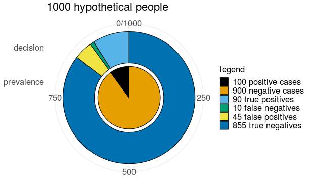

```{r setup, include=FALSE}

knitr::opts_chunk$set(echo = FALSE,
                      fig.margin = TRUE,
                      out.height = "10%")

library(ggplot2)

```

# Thinking Through Bayesian Ideas

[https://agrogan.shinyapps.io/Thinking-Through-Bayes/](https://agrogan.shinyapps.io/Thinking-Through-Bayes/)

```{r}


```

```{r, fig.margin=FALSE, out.height="20%"}



```

# The Value of Accepting the Null Hypothesis

[https://agrogan1.github.io/Bayes/accepting-H0/accepting-H0.html](https://agrogan1.github.io/Bayes/accepting-H0/accepting-H0.html)

```{r, fig.height=2}


```

```{r, fig.margin=FALSE, out.height="20%"}

N <- 1000

x1 <- rnorm(N, 100.0, 10)

x2 <- rnorm(N, 100.5, 5)

x <- c(x1, x2)

group <- c(rep("x1", N),
           rep("x2", N))

# t.test(x1, x2)

mydata <- data.frame(x, group)

ggplot(mydata,
       aes(x = x,
           fill = group)) +
  geom_density(alpha = .5) +
  # facet_wrap(~group) +
  # scale_fill_viridis_d() +
  scale_fill_manual(values = c("blue", "gold")) +
  labs(title = expression(paste("Accept ", 
                                H[0],
                                ": ",
                                "Outcomes Are Equivalent")),
       x = "outcome") +
  theme_minimal()


```


